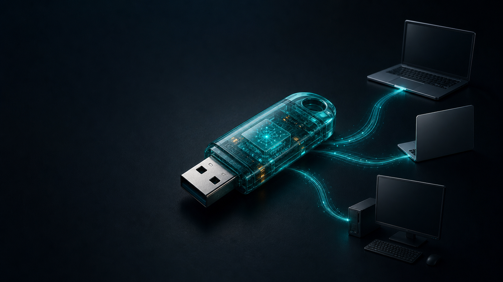

<p align="center">
  
</p>

<h1 align="center">U-Claw（虾盘）</h1>

<p align="center"><strong>把 AI 工作空间装进 U 盘：插上任意电脑，配置、记忆和工具都跟着走。</strong></p>

<p align="center">
  <a href="https://github.com/dongsheng123132/u-claw/releases">下载便携版</a> ·
  <a href="https://u-claw.org/tutorial.html">完整教程</a> ·
  <a href="#快速开始制作便携版-u-盘">从源码制作</a> ·
  <a href="#企业服务">企业服务</a> ·
  <a href="#english">English</a>
</p>

<p align="center">
  <a href="https://opensource.org/licenses/MIT"></a>
  
  
</p>

> [!IMPORTANT]
> 这不是 U 盘制作工具。这个仓库就是 U 盘的文件骨架：运行一次 `setup.sh` 补齐运行时，再把整个 `portable/` 拷到盘里即可。

## 三步开始

> 📺 图文教程：[docs/快速上手.md](docs/快速上手.md)（含真实界面截图，5 步从插 U 盘到开始对话）

1. 从 [Releases](https://github.com/dongsheng123132/u-claw/releases) 下载 Windows 便携版，解压到 U 盘后双击 `Windows-Start.bat`。
2. 或克隆仓库，在 `portable/` 运行 `bash setup.sh`，下载 Node.js 与 OpenClaw。
3. 首次启动在本地配置模型 Key；配置只保存在 U 盘的 `data/.openclaw/openclaw.json`。

| 你得到什么 | 为什么重要 |
| --- | --- |
| 随身 AI 工作空间 | 换电脑时带走配置、记忆、会话与设备授权；仅可重建的浏览器缓存留在主机。 |
| 本地优先 | 不绑定设备、不打指纹、不上传本地配置。 |
| 多种使用方式 | 便携 U 盘、在线一键安装、可启动 Linux U 盘各自独立。 |

*平台支持：Windows ✅（免部署完整包）· macOS ✅ · 可启动 Linux U盘 ✅ —— 详见下方平台支持表。*

> [!TIP]
> ### 👑 同作者新品：U-King · AI 装机管家
> 一键装好 **Claude Code / Codex / OpenClaw / Hermes** 四大 AI 神器，驱动自动配好——一个 Key 直用 Claude、GPT、DeepSeek、Kimi 等 24+ 全球模型，免翻墙。绿色版仅几 MB，双击即用，还带 AI 作图 / 视频 / 本地大模型 / 多终端工作台。
>
> **免费下载：[www.u-king.org](https://www.u-king.org)**（国内镜像 [cloud.u-claw.org/uking](https://cloud.u-claw.org/uking/)）
>
> *U-Claw 让 AI 住进 U 盘；U-King 帮你把全套 AI 编程神器装进电脑。*
> *EN: U-King — one-click installer for Claude Code / Codex / OpenClaw, with one API key for 24+ global models → [u-king.org](https://www.u-king.org)*

---

<a id="中文"></a>

## 中文

### 这是什么

U-Claw（虾盘）是一个**制作教程 + 全套源代码**，教你把 [OpenClaw](https://github.com/openclaw/openclaw)（开源 AI 助手框架）做成 U 盘——插上任意电脑，双击就能用 AI。为什么叫虾盘？U-Claw = USB + Claw（虾钳），U 盘 + AI = 虾盘。

代码库本身就是 U 盘的文件骨架，运行 `setup.sh` 补齐大依赖后，整个 `portable/` 目录直接拷贝到 U 盘即可。

> 📖 **[完整教程](https://u-claw.org/tutorial.html)** — 从零开始的手工安装指南、模型配置、聊天平台接入，小白也能看懂。

### 🧩 模型随便选：国内外大模型都能用

U-Claw 是纯开源工具，**不绑定设备、不打指纹、不上传任何数据**。首次启动会自动打开 Config 页面，选一个模型、填入自己的 API Key 即可一键启动：

- **虾盘云（首选 · 中转站）**：一个 Key 调用 DeepSeek / Claude / GPT / 通义 等国内外全部大模型，无需翻墙。注册并充值：[u-claw.org/cloud.html](https://u-claw.org/cloud.html)
- **各家官方 Key 也行**：DeepSeek、通义千问、Kimi、智谱 GLM、豆包、MiniMax（国内）/ OpenAI、Claude、Groq（国外）/ 硅基流动、任意 OpenAI 兼容地址（自定义）
- **配置只存在本地** `data/.openclaw/openclaw.json`，拔盘不留痕

### 一键安装（推荐）

不需要 U 盘，一行命令直接装到电脑：

```bash
# Mac / Linux
curl -fsSL https://u-claw.org/install.sh | bash

# Windows (PowerShell 管理员)
irm https://u-claw.org/install.ps1 | iex
```

自动完成: Node.js 下载 → OpenClaw 安装 → 10 个中国技能 → 模型配置 → 启动脚本生成。全程国内镜像，无需翻墙。

详见 [`install/README.md`](install/README.md)。

### 快速开始：制作便携版 U 盘

```bash
# 1. 克隆代码
git clone https://github.com/dongsheng123132/u-claw.git

# 2. 补齐大依赖（Node.js + OpenClaw，国内镜像，约 1 分钟）
cd u-claw/portable && bash setup.sh

# 3. 拷贝到 U 盘
cp -R portable/ /Volumes/你的U盘/U-Claw/   # Mac
# 或 Windows 资源管理器直接拖过去
```

**完成！** 插上 U 盘，双击启动脚本就能用。

> 同一支 U 盘同时只会启动一个 U-Claw 实例。重复双击会打开已运行的 Dashboard，不会另起端口或并发写入会话；如需重启，请先退出原启动窗口。

### U 盘功能一览

| 功能 | Mac | Windows |
|------|-----|---------|
| **免安装运行** | `Mac-Start.command` | `Windows-Start.bat` |
| **功能菜单** | `Mac-Menu.command` | `Windows-Menu.bat` |
| **安装到电脑** | `Mac-Install.command` | `Windows-Install.bat` |
| **首次配置** | `Config.html` | `Config.html` |

### U 盘文件结构

```
U-Claw/                          ← 整个拷到 U 盘
├── Mac-Start.command             Mac 免安装运行
├── Mac-Menu.command              Mac 功能菜单
├── Mac-Install.command           安装到 Mac
├── Windows-Start.bat             Windows 免安装运行
├── Windows-Menu.bat              Windows 功能菜单
├── Windows-Install.bat           安装到 Windows
├── Config.html                   首次配置页面
├── setup.sh                      补齐依赖（开发者用）
├── app/                          ← 大依赖（setup.sh 下载，不进 git）
│   ├── core/                        OpenClaw + QQ 插件
│   └── runtime/
│       ├── node-mac-arm64/          Mac Apple Silicon
│       ├── node-mac-x64/           Mac Intel
│       └── node-win-x64/           Windows 64-bit
└── data/                         ← 用户数据（不进 git）
    ├── .openclaw/                   配置文件
    ├── memory/                      AI 记忆
    └── backups/                     备份
```

### Linux 可启动版

连操作系统都没有？没关系。可启动版可以让任意电脑从 U 盘直接启动 Ubuntu + AI：

- 本仓库内：[`bootable/`](bootable/) 目录（与其他模块完全独立，互不影响）
- 独立仓库：[u-claw-linux](https://github.com/dongsheng123132/u-claw-linux)（内容一致，方便单独克隆）

基于 Ventoy + Ubuntu 24.04 LTS + 持久化存储，在 Windows 上运行 4 步 PowerShell 脚本即可制作。详见 [`bootable/README.md`](bootable/README.md)。

> **关于桌面安装版（Electron）**：`u-claw-app/` 的 Electron 桌面版（`.exe` 安装版 / 绿色版 / `.dmg`）**已于 2026-06-19 停止发布并归档**，原因见 [`u-claw-app/DEPRECATED.md`](u-claw-app/DEPRECATED.md)。U-Claw 现在只发布「便携 U 盘版」——这才是产品的本质：插上 U 盘、解压即用。

### 直接下载发行版

[GitHub Releases](https://github.com/dongsheng123132/u-claw/releases) 提供便携 U 盘版：

- `u-claw-portable-windows-vX.Y.Z.zip` — Windows 便携完整版（已预装 Node + OpenClaw，**解压到 U 盘双击 `Windows-Start.bat` 即用**）
- **Mac**：源码在 [`portable/`](portable/) 目录，`bash setup.sh` 自动下载 Node + OpenClaw（国内镜像约 1 分钟），双击 `Mac-Start.command` 启动

> ⚠️ **U 盘请用 NTFS 格式**（不要 exFAT/FAT32）：Node.js 在 exFAT 上 IO 极慢且不支持符号链接，可能导致启动失败。
>
> 两种格式的实测差异（v2.1.20，真机验证）：
>
> | | exFAT / FAT32 | NTFS |
> |---|---|---|
> | 网关启动与对话 | ✅ 正常可用 | ✅ 正常可用 |
> | V8 编译缓存落本机加速 | ✅ 生效（缓存自动放 `%LOCALAPPDATA%\U-Claw`） | ✅ 同左 |
> | 浏览器用户数据与缓存 | ✅ 受管 Chromium 自动落在本机盘 | ✅ 同左 |
>
> 一句话：浏览器与 Node 的可重建高频 IO 会自动落在本机盘；`data/.openclaw` 中的 SQLite 会话、设备身份、授权与配置始终随 U 盘携带。换电脑后浏览器网站登录态需要在该电脑重新登录。仍建议使用 NTFS，以避免安装依赖或其它需要链接能力的操作在 exFAT/FAT32 上变慢或受限。

### 支持的 AI 模型

**国产模型（无需翻墙）：**

| 模型 | 推荐场景 |
|------|----------|
| DeepSeek | 编程首选，极便宜 |
| Kimi K2.5 | 长文档，256K 上下文 |
| 通义千问 Qwen | 免费额度大 |
| 智谱 GLM | 学术场景 |
| MiniMax | 语音多模态 |
| 豆包 Doubao | 火山引擎 |

**国际模型：** Claude · GPT · Gemini（需翻墙或中转）

### 支持的聊天平台

| 平台 | 状态 | 说明 |
|------|------|------|
| QQ | ✅ 已预装 | 输入 AppID + Secret 即可 |
| 飞书 | ✅ 内置 | 企业首选 |
| Telegram | ✅ 内置 | 海外推荐 |
| WhatsApp | ✅ 内置 | Baileys 协议 |
| Discord | ✅ 内置 | — |
| 微信 | ⚠️ 暂不可用 | 上游插件兼容问题，修复后随更新恢复 |

### 国内镜像

所有脚本默认走国内镜像，无需翻墙：

| 资源 | 镜像 |
|------|------|
| npm 包 | `registry.npmmirror.com` |
| Node.js | `npmmirror.com/mirrors/node` |
| Electron | `npmmirror.com/mirrors/electron` |

### 开发 & 贡献

```bash
git clone https://github.com/dongsheng123132/u-claw.git
cd u-claw/portable && bash setup.sh
bash Mac-Start.command   # Mac 测试
```

**平台支持：**

| 平台 | 状态 | 说明 |
|------|------|------|
| Mac Apple Silicon (M1-M4) | ✅ | 便携版 |
| Mac Intel (x64) | ✅ | 便携版 |
| Windows x64 | ✅ | 便携版（含免部署完整包） |
| Linux x64（可启动 U 盘） | ✅ | [`bootable/`](bootable/) 目录 |

欢迎 PR！特别需要：教程翻译、文档完善。

### 🦞 寻找技术伙伴

U-Claw 是一个快速成长的开源项目，目前已有不少商业合作机会。

我们正在寻找：
- **技术伙伴** — 全栈 / Node.js / Electron / 脚本自动化
- **资源合作** — 渠道、内容、社区运营

如果你对 AI 工具的落地和商业化感兴趣，欢迎联系：

- 微信: hecare888
- Telegram: [@dsds8848](https://t.me/dsds8848)
- Twitter/X: [@Bitplus888](https://x.com/Bitplus888)
- Email: [hefangsheng@gmail.com](mailto:hefangsheng@gmail.com)
- GitHub: [@dongsheng123132](https://github.com/dongsheng123132)
- 官网: [u-claw.org](https://u-claw.org)

### FAQ

**Q: 需要翻墙吗？**
不需要。安装和运行全程使用国内镜像，国产模型 API 直连。

**Q: U 盘需要多大？**
4GB+（完整约 2.3GB）。

**Q: 能分发吗？**
MIT 协议，随便复制分发。

**Q: Mac 提示"未验证的开发者"？**
右键脚本 → 打开。

**Q: setup.bat / setup.sh 执行失败，提示模块找不到？**
通常是 npm install 过程中网络中断导致 `node_modules` 不完整。解决步骤：
1. 删除不完整的依赖：`rmdir /s /q portable\app\core\node_modules`（Windows）或 `rm -rf portable/app/core/node_modules`（Mac）
2. 切换淘宝镜像重新安装：`cd portable/app/core && npm install --registry=https://registry.npmmirror.com`

**Q: 系统已有 Node.js v24，安装失败？**
Node.js v24 是最新开发版，部分依赖尚不兼容。需要 **v20 或 v22 LTS**。删除已下载的 runtime 目录后重新运行 setup，它会自动下载内置的 Node v22：
```bash
# Windows
rmdir /s /q portable\app\runtime\node-win-x64
setup.bat

# Mac
rm -rf portable/app/runtime/node-mac-arm64
bash setup.sh
```

**Q: Mac 上提示 `.toSorted is not a function`？**
系统旧版 Node.js 被检测到并跳过了内置版本下载，但旧版 Node 不支持 `.toSorted()`（需要 v20+）。删除 runtime 目录让脚本重新下载内置 Node v22：
```bash
rm -rf portable/app/runtime/node-mac-arm64
bash setup.sh
```

**Q: 如何同时配置多个 AI 模型并切换？**
支持同时配置多个 provider！打开 `Config.html` → 在 Providers 区域点击「添加」，逐个填入各模型的 API Key 和地址（如 DeepSeek、Kimi、通义等）→ 保存后，在聊天界面左上角下拉菜单随时切换。配置持久保存在 U 盘上。

**Q: U 盘安装后无法创建文件 / 写入失败？**
两种可能：① U 盘侧面有物理写保护开关，拨到解锁位置；② U 盘不是 **NTFS** 格式——本产品要求 NTFS（exFAT/FAT32 会导致启动缓慢、写入失败甚至启动失败）。备份数据后重新格式化为 NTFS 即可。

**Q: 从 Ubuntu 向 U 盘复制时符号链接丢失？**
`node_modules/.bin/` 下有大量符号链接，FAT32/exFAT 在直接 `cp -R` 时会跳过。用 `rsync -aL` 可将符号链接展开为真实文件：
```bash
rsync -aL --progress portable/ /media/YOUR_USB/U-Claw/
```

**Q: QQbot 报错 `Unknown channel: qqbot`？**
Bundle 里的 `@sliverp/qqbot` 是未编译的 TypeScript 源码，需要先编译：
```bash
cd portable/app/core/node_modules/@sliverp/qqbot
npm install && npm run build
```
正式 Release 包已修复此问题，建议从 [Releases](https://github.com/dongsheng123132/u-claw/releases) 下载最新版。

<a id="企业服务"></a>

### 💼 企业 AI 落地服务（付费）

U-Claw 免费开源，自己装了用完全够，不用买任何东西。

但如果你要把 AI **落进公司的业务流程**——客服、文档、质检、报价、内部知识库——
那是另一件事。我是 [贺去病](https://hequbing.com)，独立 AI 产品开发者，做过 50+ 个交付项目，
方案到上线一个人能兜住。这部分按项目收费：

| 服务 | 你拿到什么 | 价格 |
| :-- | :-- | :-- |
| **AI 需求诊断** | 30 分钟通话：哪些环节值得上 AI、哪些是坑、大概多少钱 | **免费** |
| **AI 方案设计** | 完整方案：技术选型 + 成本估算 + 实施路径 | ¥3,000 起 |
| **快速 POC** | 2 周内交付能演示的原型，先验证可行再投钱 | ¥8,000 起 |
| **落地陪跑** | 从方案到上线全程跟，含团队培训 | ¥20,000 起 |
| **U-Claw 企业定制** | 私有化部署、批量装机、内网版、白标 | 面议 |

**从免费诊断开始，不合适我会直接说不合适** —— 微信 hecare888 ·
[hefangsheng@gmail.com](mailto:hefangsheng@gmail.com) · [hequbing.com](https://hequbing.com)

---

### 联系 & 合作


- 微信: hecare888（或扫右侧二维码）
- Telegram: [@dsds8848](https://t.me/dsds8848)
- Twitter/X: [@Bitplus888](https://x.com/Bitplus888)
- Email: [hefangsheng@gmail.com](mailto:hefangsheng@gmail.com)
- GitHub: [@dongsheng123132](https://github.com/dongsheng123132)
- 官网: [u-claw.org](https://u-claw.org)

**🤝 招募代理 / 带货合作**

虾盘 3.0 体验极佳，退货率极低，售后由我们负责——你只管卖货：

- **抖店 / 直播带货**：提供最高佣金比例，产品已在多个直播间验证转化
- **代理分销**：买断或按单分润均可谈，支持定制版本
- **技术合作**：有开发能力者欢迎深度合作
- **👑 U-King 装机管家分销（新）**：[U-King](https://www.u-king.org) 软件本身免费送客户，客户按用量给 AI 模型 API 充值，你拿**持续分润**——不压货、零售后（我们负责），赚的是长期流水。适合装机店、AI 培训、社群主理人

有意向请微信联系（备注「代理合作」优先处理）。

---

<a id="english"></a>

## English

<p align="center">
  <a href="https://github.com/dongsheng123132/u-claw/releases">Download</a> ·
  <a href="https://u-claw.org/tutorial.html">Full tutorial</a> ·
  <a href="#enterprise-services">Enterprise services</a>
</p>

### What is this

U-Claw (aka "虾盘" / "Xia Pan" in Chinese, meaning "Claw Drive") is a **tutorial + complete source code** for building an [OpenClaw](https://github.com/openclaw/openclaw) (open-source AI assistant framework) USB drive — plug it into any computer, double-click, and start using AI.

The codebase itself is the USB file skeleton. Run `setup.sh` to download large dependencies, then copy the entire `portable/` directory to a USB drive.

> 📖 **[Full Tutorial](https://u-claw.org/tutorial.html)** — Step-by-step manual installation, model setup, chat platform integration.

### One-Line Install (Recommended)

No USB needed — install directly to your computer:

```bash
# Mac / Linux
curl -fsSL https://u-claw.org/install.sh | bash

# Windows (PowerShell as Admin)
irm https://u-claw.org/install.ps1 | iex
```

Automatically downloads Node.js, installs OpenClaw, configures 10 Chinese-optimized skills, and sets up your AI model. All downloads use China mirrors.

See [`install/README.md`](install/README.md) for details.

### Quick Start: Build a Portable USB

```bash
# 1. Clone
git clone https://github.com/dongsheng123132/u-claw.git

# 2. Download dependencies (Node.js + OpenClaw, ~1 min)
cd u-claw/portable && bash setup.sh

# 3. Copy to USB drive
cp -R portable/ /Volumes/YOUR_USB/U-Claw/   # Mac
# Or drag & drop on Windows
```

**Done!** Plug in the USB, double-click the start script, and you're running AI.

> Only one U-Claw instance runs per USB drive. A second click reopens the existing Dashboard instead of selecting another port or writing sessions concurrently. To restart, exit the original launcher first.

### USB Features

| Feature | Mac | Windows |
|---------|-----|---------|
| **Run (no install)** | `Mac-Start.command` | `Windows-Start.bat` |
| **Menu** | `Mac-Menu.command` | `Windows-Menu.bat` |
| **Install to PC** | `Mac-Install.command` | `Windows-Install.bat` |
| **First-time config** | `Config.html` | `Config.html` |

### File Structure

```
U-Claw/                          ← Copy entire folder to USB
├── Mac-Start.command             Mac launcher
├── Mac-Menu.command              Mac menu
├── Mac-Install.command           Install to Mac
├── Windows-Start.bat             Windows launcher
├── Windows-Menu.bat              Windows menu
├── Windows-Install.bat           Install to Windows
├── Config.html                   First-time config page
├── setup.sh                      Download dependencies (dev use)
├── app/                          ← Large deps (downloaded by setup.sh, not in git)
│   ├── core/                        OpenClaw + QQ plugin
│   └── runtime/
│       ├── node-mac-arm64/          Mac Apple Silicon
│       ├── node-mac-x64/           Mac Intel
│       └── node-win-x64/           Windows 64-bit
└── data/                         ← User data (not in git)
    ├── .openclaw/                   Config file
    ├── memory/                      AI memory
    └── backups/                     Backups
```

### Linux Bootable USB

No operating system? No problem. Boot any computer from USB into Ubuntu + AI:

- In this repo: [`bootable/`](bootable/) directory (fully independent from other modules)
- Standalone repo: [u-claw-linux](https://github.com/dongsheng123132/u-claw-linux) (same content, easier to clone separately)

Based on Ventoy + Ubuntu 24.04 LTS + persistence. 4-step PowerShell scripts on Windows. See [`bootable/README.md`](bootable/README.md) for details.

> **About the Electron desktop app**: `u-claw-app/` (the `.exe` installer / portable / `.dmg` builds) was **deprecated and is no longer published as of 2026-06-19** — see [`u-claw-app/DEPRECATED.md`](u-claw-app/DEPRECATED.md). U-Claw now ships only the portable USB build, which is the product's essence: plug in the USB and run.

### Supported AI Models

**Chinese models (no VPN needed):**

| Model | Best for |
|-------|----------|
| DeepSeek | Coding, extremely cheap |
| Kimi K2.5 | Long documents, 256K context |
| Qwen | Large free tier |
| GLM (Zhipu) | Academic use |
| MiniMax | Voice & multimodal |
| Doubao | Volcengine ecosystem |

**International models:** Claude · GPT · Gemini (VPN or relay required in China)

### Supported Chat Platforms

| Platform | Status | Notes |
|----------|--------|-------|
| QQ | ✅ Pre-installed | Enter AppID + Secret |
| Feishu (Lark) | ✅ Built-in | Enterprise favorite |
| Telegram | ✅ Built-in | International |
| WhatsApp | ✅ Built-in | Baileys protocol |
| Discord | ✅ Built-in | — |
| WeChat | ✅ Community plugin | iPad protocol |

### China Mirrors

All scripts use China mirrors by default — no VPN needed:

| Resource | Mirror |
|----------|--------|
| npm packages | `registry.npmmirror.com` |
| Node.js | `npmmirror.com/mirrors/node` |
| Electron | `npmmirror.com/mirrors/electron` |

### Development & Contributing

```bash
git clone https://github.com/dongsheng123132/u-claw.git
cd u-claw/portable && bash setup.sh
bash Mac-Start.command   # Test on Mac
```

**Platform Support:**

| Platform | Status | Notes |
|----------|--------|-------|
| Mac Apple Silicon (M1-M4) | ✅ | Portable |
| Mac Intel (x64) | ✅ | Portable |
| Windows x64 | ✅ | Portable (full offline bundle) |
| Linux x64 (Bootable USB) | ✅ | [`bootable/`](bootable/) directory |

PRs welcome! Especially: documentation, tutorials.

### 🔧 Professional Services / 专业服务

Need help? We offer remote support and custom development:

| Service | Description | Price |
|---------|-------------|-------|
| **Remote Installation** | We remotely install OpenClaw + skills + model config for you | Free |
| **Troubleshooting** | Startup failures, port conflicts, network issues | From ¥50 |
| **Model Tuning** | API key setup, model switching, prompt optimization | From ¥50 |
| **Custom Development** | Custom skills, enterprise private deployment, QQ/WeChat/Feishu bot integration | From ¥200 |
| **USB Green Edition** | Pre-built portable USB with your custom skills & models | From ¥100 |

**One-click remote support** — run one command, we connect and fix it:

```bash
# Mac / Linux
curl -fsSL https://u-claw.org/remote.sh | bash

# Windows (Admin PowerShell)
irm https://u-claw.org/remote.ps1 | iex
```

WeChat: **hecare888** (备注「U-Claw 远程」优先处理)

👉 [View full service details / 查看完整服务详情](https://u-claw.org/guide.html#remote-support)

### 🦞 Looking for Partners

U-Claw is a fast-growing open-source project with real commercial opportunities.

We're looking for:
- **Technical partners** — Full-stack / Node.js / Electron / scripting
- **Resource partners** — Distribution, content, community

If you're interested in AI tooling and commercialization, let's talk:

- Telegram: [@dsds8848](https://t.me/dsds8848)
- Twitter/X: [@Bitplus888](https://x.com/Bitplus888)
- Email: [hefangsheng@gmail.com](mailto:hefangsheng@gmail.com)
- GitHub: [@dongsheng123132](https://github.com/dongsheng123132)
- WeChat: hecare888
- Website: [u-claw.org](https://u-claw.org)

### FAQ

**Q: Do I need a VPN?**
No. All downloads use China mirrors. Chinese AI model APIs work directly.

**Q: How big should the USB drive be?**
4GB+ (~2.3GB full).

**Q: Can I redistribute?**
MIT license — copy and share freely.

**Q: Mac says "unverified developer"?**
Right-click the script → Open.

**Q: setup.bat / setup.sh fails with "module not found"?**
Usually caused by a network interruption during `npm install`, leaving `node_modules` incomplete. Fix:
1. Delete incomplete dependencies: `rmdir /s /q portable\app\core\node_modules` (Windows) or `rm -rf portable/app/core/node_modules` (Mac)
2. Reinstall using China mirror: `cd portable/app/core && npm install --registry=https://registry.npmmirror.com`

**Q: Already have Node.js v24 and installation fails?**
Node.js v24 is a dev release — some dependencies aren't compatible yet. You need **v20 or v22 LTS**. Delete the runtime folder to force a fresh download of the bundled Node v22:
```bash
# Windows
rmdir /s /q portable\app\runtime\node-win-x64
setup.bat

# Mac
rm -rf portable/app/runtime/node-mac-arm64
bash setup.sh
```

**Q: Mac shows `.toSorted is not a function`?**
Your system Node.js was detected and the bundled version was skipped, but the system version is too old (needs v20+). Delete the runtime folder to re-download the bundled Node v22:
```bash
rm -rf portable/app/runtime/node-mac-arm64
bash setup.sh
```

**Q: How do I use multiple AI models / providers?**
Multiple providers are supported! Open `Config.html` → click "Add" in the Providers section → enter API Key and endpoint for each model (DeepSeek, Kimi, Qwen, etc.) → save. Switch between models via the dropdown in the chat interface. Config is saved persistently on the USB drive.

**Q: USB drive shows "cannot create file" / write errors?**
Two possibilities: ① The USB drive has a physical write-protect switch on the side — slide it to unlock; ② The drive is not **NTFS** — this product requires NTFS (exFAT/FAT32 causes slow startup, write failures, or boot failure). Back up your data and reformat as NTFS.

**Q: Symlinks missing when copying from Ubuntu to USB?**
`node_modules/.bin/` contains many symlinks that get skipped during direct `cp -R`. Use `rsync -aL` to expand symlinks into real files:
```bash
rsync -aL --progress portable/ /media/YOUR_USB/U-Claw/
```

**Q: QQbot error: `Unknown channel: qqbot`?**
The bundled `@sliverp/qqbot` is uncompiled TypeScript source. Compile it manually:
```bash
cd portable/app/core/node_modules/@sliverp/qqbot
npm install && npm run build
```
This is fixed in the latest [Release](https://github.com/dongsheng123132/u-claw/releases) — downloading the pre-built release is recommended.

<a id="enterprise-services"></a>

### 💼 Enterprise AI Consulting (paid)

U-Claw is free and MIT-licensed. Installing it for yourself costs nothing and needs nothing from me.

Putting AI **into your company's actual workflow** — support, documents, QA, quoting, internal
knowledge bases — is a different job. I'm [He Qubing](https://hequbing.com), an independent AI product
developer with 50+ delivered projects; I can carry a project from scoping to production on my own.
That part is paid:

| Service | What you get | Price |
| :-- | :-- | :-- |
| **AI scoping call** | 30 min: what's worth automating, what will burn you, rough budget | **Free** |
| **Solution design** | Full plan: stack selection, cost model, rollout path | from ¥3,000 (~$420) |
| **Rapid POC** | A working demo in 2 weeks — validate before you spend | from ¥8,000 (~$1,100) |
| **Hands-on delivery** | Scoping through production, including team training | from ¥20,000 (~$2,800) |
| **U-Claw for teams** | Self-hosted, bulk provisioning, air-gapped, white-label | Let's talk |

**Start with the free call — if it's a bad fit I'll say so** —
[hefangsheng@gmail.com](mailto:hefangsheng@gmail.com) · [hequbing.com](https://hequbing.com)

---

### Contact & Partnership


- WeChat: hecare888 (or scan QR on the right)
- Telegram: [@dsds8848](https://t.me/dsds8848)
- Twitter/X: [@Bitplus888](https://x.com/Bitplus888)
- Email: [hefangsheng@gmail.com](mailto:hefangsheng@gmail.com)
- GitHub: [@dongsheng123132](https://github.com/dongsheng123132)
- Website: [u-claw.org](https://u-claw.org)

**🤝 Reseller / Affiliate Program**

U-Claw 3.0 delivers excellent user experience with very low return rates. We handle all after-sales support — you focus on selling:

- **Live commerce / TikTok shop**: Top commission rates, proven conversion in live streams
- **Reseller / distribution**: Revenue share or wholesale, custom branded versions available
- **Technical partnership**: Deep collaboration welcome for developers
- **👑 U-King distribution (new)**: give away [U-King](https://www.u-king.org) (free AI setup manager) — earn **recurring revenue share** on your customers' API top-ups. No inventory, we handle support

Interested? WeChat hecare888 (mention "partnership" for priority response).

---

**Made with 🦞 by [贺去病 ai 工作室](https://github.com/dongsheng123132)**
