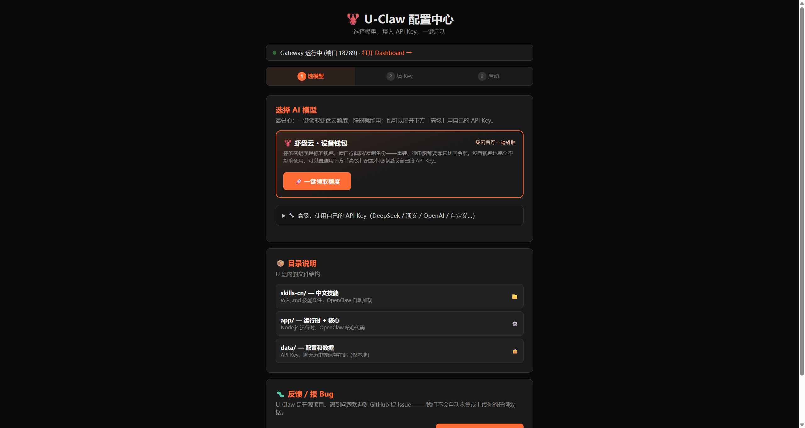
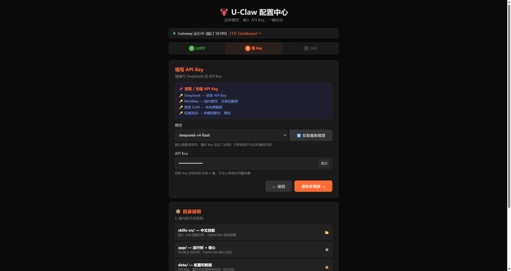
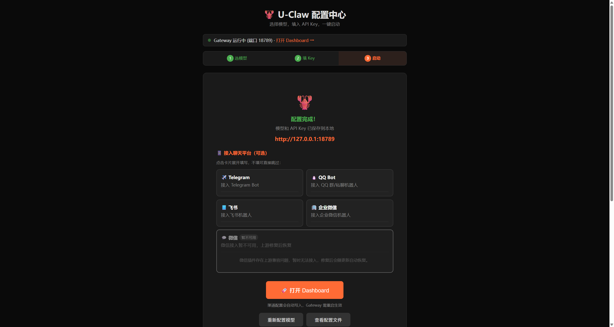

# U-Claw 快速上手

把整个 U-Claw 文件夹放进 **NTFS 格式**的 U 盘后，按下面步骤操作即可。首次使用建议保持联网，以便完成模型或渠道配置。

## 第 1 步：双击启动

- Windows：双击 `Windows-Start.bat`。
- Mac：双击 `Mac-Start.command`。

首次启动会打开配置中心；以后启动完成后可直接进入对话页面。

## 第 2 步：在配置中心选模型

推荐直接选择 **「虾盘云·设备钱包」**，点击一键领取额度即可开始使用；这是默认路径，不需要填写 API Key。

> ⚠️ **重要**：选择设备钱包时，**你的密钥就是你的钱包**——请按页面提示备份好密钥。重装系统、换电脑、U 盘损坏后，都要靠它找回余额；丢失即无法找回。

若要使用自己的模型账号，请展开 **「高级：使用自己的 API Key」**，再选择 DeepSeek 等模型服务。

## 第 3 步：填写 API Key（仅使用自己的 Key 时）

这一步只在上一步选择自己的模型账号时出现。粘贴从模型服务商获取的 API Key，点击「保存并继续」。使用设备钱包时可跳过本步。

## 第 4 步：接入聊天平台（可选）

> 以下「第 4、5 步」都发生在配置中心的第 3 步（启动页）里。

需要在聊天软件中使用时，可按卡片提示接入 Telegram、QQ、飞书或企业微信。微信目前显示「暂不可用」，待上游修复后会恢复。

不接入聊天平台也不影响直接在浏览器中对话。

## 第 5 步：打开对话页面

点击「打开 Dashboard」即可开始对话。启动脚本会自动打开正确地址；如果需要手动打开，地址是 `http://127.0.0.1:18789/#token=uclaw`（端口可能因占用顺延，以启动窗口提示为准，`#token=uclaw` 不能省）。

## 使用提示

- U 盘请使用 **NTFS** 格式；不要使用 exFAT 或 FAT32，以免启动缓慢或链接功能异常。
- 遇到问题请到 [GitHub Issue](https://github.com/dongsheng123132/u-claw/issues) 反馈，并附上诊断工具生成的信息。
